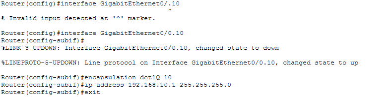
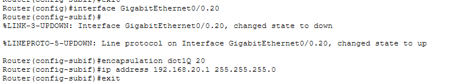

# Segmentación de Red y Enrutamiento Inter-VLAN: Sucursal Logística 🚢🌐

## 1. El Escenario de Negocio
En la operación de una terminal aduanal, la **VLAN de Operaciones (pedimentos)** y la **VLAN de Administración (Nóminas/RRHH)** deben estar aisladas para reducir el dominio de broadcast y mejorar la seguridad, permitiendo comunicación solo a través de una puerta de enlace (Gateway) controlada.

**Objetivo** Implementar la arquitectura "Router-on-a-Stick" para permtir el flujo de datos eficiente entre departamentos

## 2. Arquitectura y Segmentación
Se definieron los siguientes segmentos de red para la sucursal:

| Departamento | VLAN | Interfaz Lógica | Dirección IP (Gateway) | Máscara |
| :--- | :---: | :--- | :--- | :--- |
| **Operaciones** | 10 | G0/0.10 | 192.168.10.1 | 255.255.255.0 |
| **Administración** | 20 | G0/0.20 | 192.168.20.1 | 255.255.255.0 |

## 3. Implementación en Router (Cisco IOS)

La clavde la Arquitectura "router-on-a-Stick" es la creación de subinterfaces lógicas en un mismo puerto físico. A continuación se presenta la evidencia de la configuración detallada para cada departamento:

### 3.1 Configuración del Gateway para Operaciones (VLAN 10) 

Se habilitó la subinterfaz `G0/0.10` con encapsulamiento IEEE 802.1Q para la VLAN 10. Esta interfaz funcionará como la puerta de enlace predeterminada para todos los equipos de red de Operaciones

**Nota técnica:" En la captura superior se observa la corrección manual tras un error de sintaxxis inicial. Este proceso validó la importancia de la precisión en la nomeclatura de subinterfaces para el correcto funcionamiento del stick del router

### 3.2 Configuración del Gateway para Administración (VLAN 20)

Continuando el proceso, se configuró la subinterfaz `G0/0.20` para la red Administración. Es crucial notar que cada subinterfaz posee su propia dirección IP dentro de su respectivo segmento de red para evitar conflictos de enrutamiento

## 4. Validación de Conectividad

Se confirmó el enrutamiento exitoso mediante pruebas de ICMP (Ping) entre equipos de distintas VLANS.

**Prueba:** PCOPERACIONES (10.2) -> PCADMI (20.2)
- **Resultado:** Exitoso (100% de respuesta tras ARP)

